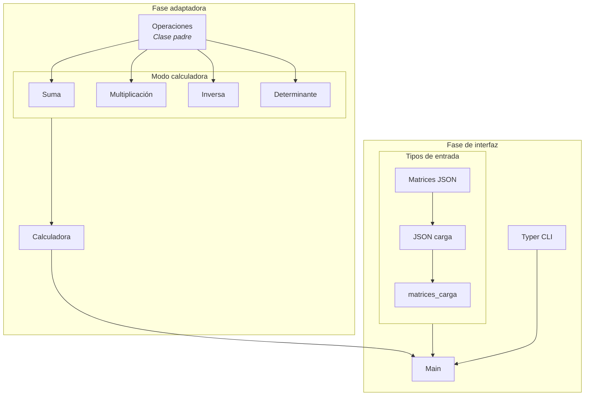

# Calculadora de Matrices — Arquitectura de Organización

## 1. Descripción General

La Calculadora de Matrices es una aplicación de línea de comandos desarrollada en Python que realiza operaciones aritméticas sobre matrices 2×2 definidas en un archivo JSON. La aplicación sigue el patrón **Interfaz-Adaptador**: una clase padre abstracta (`Operación`) define los métodos `SetMatrix`, `Compute` y `Clear`, y cada operación concreta (suma, multiplicación, inversa, determinante) hereda de ella. Una clase `calcualdora` registra las operaciones soportadas en un diccionario, y la interfaz de usuario se expone mediante **Typer**.

Este documento describe la estrategia de organización del proyecto y sirve como referencia para que todos los integrantes del equipo trabajen bajo las mismas convenciones.

---

## 2. Entorno de Desarrollo

| Herramienta | Propósito |
|---|---|
| **Python UV** | Gestión de entorno virtual y dependencias |
| **Typer** | Framework CLI para definir comandos de usuario |
| **Git / GitHub** | Control de versiones y colaboración |
---

## 3. Estructura de Carpetas

```
Github/
└── Laboratorios/
    └── lab1_cal_matriz/
        └── calculadora-matrices/
            ├── .venv/                    
            ├── docs/
            │   ├── arquitectura.md
            │   └── guia_uv.md
            ├── src/
            │   ├── main_matriz.py
            │   ├── operacion_matriz.py
            │   ├── suma_matriz.py
            │   ├── multiplicacion_matriz.py
            │   ├── inversa_matriz.py
            │   ├── determinante_matriz.py
            │   ├── json_carga.py
            │   ├── matrices_carga.py
            │   └── calculadora.py
            ├── data/
            │   └── matrices.json
            ├── test/
            │   └── ...
            ├── .python-version
            ├── pyproject.toml
            └── uv.lock 
```

- **`docs/`** — Archivos de documentación y guia_UV para nuevos usuarios.
- **`src/`** — Todo el código fuente de la aplicación.
- **`data/`** — Archivos de datos (el JSON con las matrices de entrada).
- **`test/`** — Pruebas unitarias y de integración.

---

## 4. División en Módulos

Cada módulo tiene una responsabilidad única, lo que facilita la depuración y permite que distintos integrantes trabajen en paralelo sin conflictos.

### 4.1 Clase padre — `operacion_matriz.py`

Define la interfaz abstracta `Operación` con los métodos:

| Método | Responsabilidad |
|---|---|
| `SetMatrix` | Recibe y almacena las matrices de entrada |
| `Compute` | Ejecuta la operación aritmética correspondiente |
| `Clear` | Restablece el estado interno de la operación |

Todas las operaciones concretas heredan de esta clase.

### 4.2 Operaciones concretas

| Módulo | Función principal | Descripción |
|---|---|---|
| `suma_matriz.py` | `suma_matriz()` | Suma elemento a elemento de dos matrices |
| `multiplicacion_matriz.py` | `multiplicacion_matriz()` | Producto matricial de dos matrices |
| `inversa_matriz.py` | `inversa_matriz()` | Cálculo de la matriz inversa |
| `determinante_matriz.py` | `determinante_matriz()` | Cálculo del determinante escalar |

### 4.3 Registro de operaciones — `calculadora.py`

Contiene la clase `calculadora_app`, que almacena en un diccionario las operaciones soportadas. Esto permite agregar o retirar operaciones sin modificar el flujo principal.

### 4.4 Punto de entrada — `main_matriz.py`

Instancia los módulos, registra las operaciones en la `Calculadora` y expone los comandos de Typer al usuario.

### 4.5 Datos de entrada — `matrices.json`

Archivo JSON que almacena las dos matrices sobre las que se operará. Cada matriz se representa como un arreglo bidimensional de números de punto flotante, acompañado de sus dimensiones.

---

## 5. Patrón Arquitectónico: Interfaz-Adaptador

La aplicación implementa el patrón **Interfaz-Adaptador** de la siguiente manera:



- **Interfaz:** la clase abstracta `Operación` define el contrato que toda operación debe cumplir.
- **Adaptador:** la clase `calculadora-app` adapta las operaciones registradas para que el CLI las invoque de forma uniforme sin conocer los detalles internos de cada una.

---

## 6. Flujo de Dependencias

### 6.1 Dependencias de ejecución

```
main_matriz.py
  ├── Calculadora.py (Aplicación)
  │     ├── suma_matriz.py
  │     ├── multiplicacion_matriz.py
  │     ├── inversa_matriz.py
  │     └── determinante_matriz.py
  │           └── operacion_matriz.py (clase padre)
  ├── matrices.json (datos de entrada)
  ├── matrices_carga.py
  │      └──json_carga.py
  └── Typer (librería CLI)
```

La dependencia fluye de arriba hacia abajo: `main` conoce a `calculadora`, `calculadora` conoce a las operaciones concretas, y todas dependen de la interfaz `Operación`. Ningún módulo de operación conoce al CLI ni a `main`.

### 6.2 Orden de desarrollo sugerido

1. Definir el esquema de `matrices.json` con datos de prueba.
2. Implementar `operacion_matriz.py` (clase abstracta).
3. Implementar las operaciones concretas (suma, multiplicación, inversa, determinante).
4. Implementar `calculadora.py` para registrar las operaciones.
5. Implementar `main_matriz.py` con los comandos de Typer.
6. Escribir pruebas unitarias y de casos esquina.
7. Revisión final e integración.

---

## 7. Comandos CLI (Typer)

La aplicación expone los siguientes comandos. Se espera que la interacción sea **cíclica**: el usuario puede ejecutar múltiples operaciones sin reiniciar el programa.

| Comando | Descripción |
|---|---|
| `sumar` | Suma las dos matrices cargadas |
| `multiplicar` | Multiplica las dos matrices cargadas |
| `inversa` | Calcula la inversa de la matriz seleccionada |
| `determinante` | Calcula el determinante de la matriz seleccionada |

Cada comando debe indicar claramente qué matrices utiliza y presentar el resultado en un formato legible.

---
## 8. Documentación

El proyecto mantiene una carpeta `docs/` con los archivos necesarios para que cualquier integrante o usuario externo pueda comprender, instalar y utilizar la aplicación sin depender de explicaciones verbales.
 
| Archivo | Contenido |
|---|---|
| `arquitectura.md` | Documento principal del proyecto |
| `guia_uv.md` | Guía de instalación de Python UV |
 
### 8.1 `arquitectura.md`
 
Archivo central de referencia del proyecto. Debe incluir:
 
- Descripción general del proyecto y su propósito.
- Diagrama de diseño elaborado en **Lucidchart** o **Draw.io**.
- Instrucciones de instalación del entorno y dependencias.
- Instrucciones de uso de la aplicación y sus comandos.
- Ejemplos concretos de ejecución con entrada y salida esperada.
- Créditos: integrantes del equipo, curso y profesor.
### 8.2 `guia_uv.md`
 
Guía paso a paso para instalar y configurar Python UV. Cubre los requisitos previos, el proceso de instalación y cualquier configuración adicional necesaria para ejecutar el proyecto sin problemas.

**Guia_UV:** https://github.com/Ronald-exe/Computacion_Heterogenea_2026_Grupo_XX/blob/main/Laboratorios/lab1_cal_matriz/calculadora-matrices/docs/guia_uv.md


---
## 9. Roles y Responsabilidades

### Desarrollador
* **Ambiente de trabajo:** Encargado de configurar y mantener el entorno necesario para cumplir con las matrices de trabajo.
* **Resolución de problemas:** Propone e implementa soluciones en términos de programación, diseño, conexiones y arquitectura de software.
* **Flujo de trabajo en Git:** Responsable del desarrollo bajo los estándares de Git, gestionando la creación e integración de ramas tipo `feature/` y `hotfix/`.

### Revisor
* **Control de calidad:** Encargado de supervisar el funcionamiento adecuado del programa, la correcta integración de módulos y la coherencia del esquema completo del proyecto.
* **Gestión de Pull Requests:** Responsable de revisar, probar y aceptar los *Pull Requests* dirigidos a la rama `develop`, ejecutando los *merges* correspondientes.
* **Mantenimiento del repositorio:** Encargado de eliminar ramas obsoletas tras su integración, así como supervisar el manejo de ramas de preparación (`release/`) y correcciones puntuales (`hotfix/`).

### Líder de Proyecto
* **Gestión y estrategia:** Encargado de la organización general del proyecto, asignación de tareas, definición de estándares técnicos y planificación de estrategias.
* **Soporte transversal:** Brinda asistencia y guía técnica a los demás integrantes del equipo en cualquiera de las fases del desarrollo.
* **Gestión de versiones (Releases):** Es la figura encargada de realizar los *Pull Requests* finales hacia la rama `main` para generar las versiones oficiales del sistema.


---
## 10. Convenciones de Código

| Aspecto | Convención |
|---|---|
| **Estilo** | PEP 8 |
| **Documentación** | DocStrings en cada clase, método y función |
| **Nombres de archivo** | Descriptivos y en snake_case (`suma_matriz.py`) |
| **Control de versiones** | Ramas por funcionalidad; pull requests para integrar a `main` |
| **Comunicación** | Canal acordado por el equipo + OneDrive para archivos compartidos |
