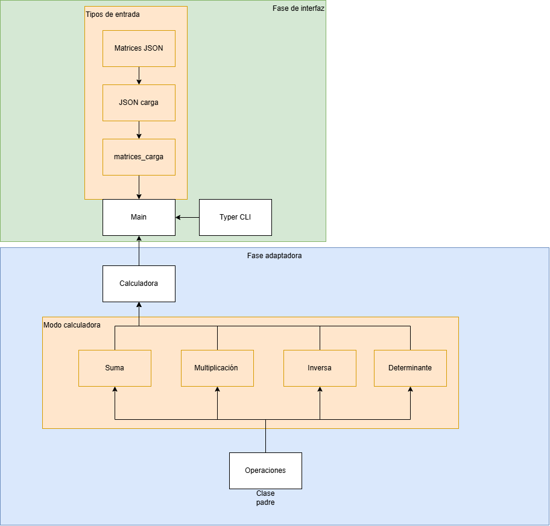
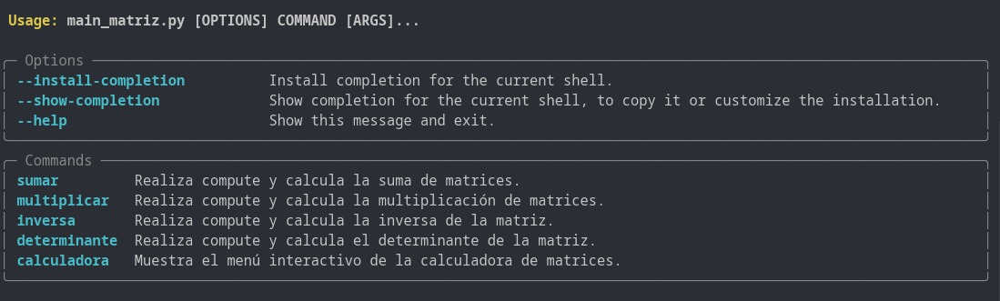
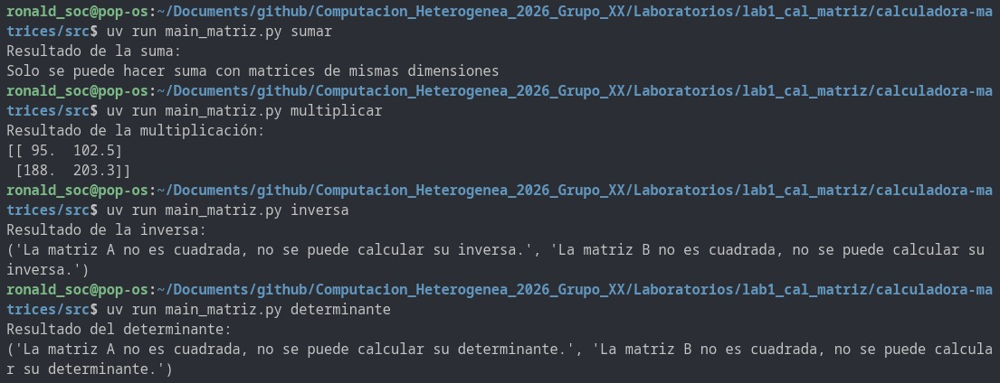
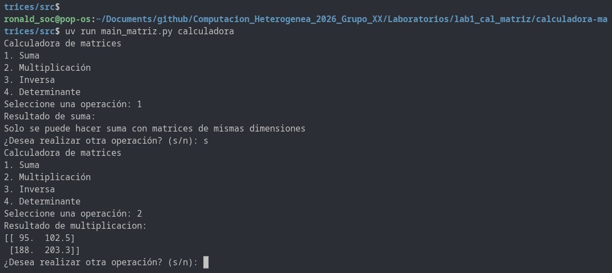

# Calculadora Matricial - Laboratorio 1
## Profesor

| Rol | Nombre |
|---|---|
| Profesor | Luis Gerardo León Vega |

## Integrantes

| Nombre | Carnet | Rol |
|---|---|---|
| Ronald Duarte Barrantes | 2021004089 | Líder de equipo |
| Katherine Salazar Martínez | 2014160591 | Desarrolladora |
| Fabián Chacón Solano | 2018135154 | Desarrollador |
| Keylor Muñoz Soto | 2020100689| Revisor |

---

## Descripción del Proyecto

La **Calculadora Matricial** es una aplicación de línea de comandos (CLI) desarrollada en Python que realiza operaciones aritméticas y algebraicas sobre matrices definidas en formato JSON. 

El sistema implementa una arquitectura basada en el patrón de diseño **Interfaz-Adaptador** y sigue un **enfoque modular**, donde cada clase e interfaz relevante se encuentra desacoplada en su propio módulo. Esta modularidad facilita el mantenimiento a largo plazo, la escalabilidad del sistema y optimiza el proceso de depuración de errores (*debugging*).

### Arquitectura de Clases y Módulos

La estructura lógica y los componentes principales del diseño se dividen de la siguiente manera:

* **Clase Abstracta `Operacion` (`operaciones.py`):** Define la interfaz base con los métodos abstractos `SetMatrix`, `Compute` y `Clear`. Actúa como la clase padre de la cual heredan todos los módulos de operaciones concretas.
* **`Suma` y `Multiplicacion`:** Operaciones binarias que requieren dos matrices como entrada. Hacen uso de la librería **NumPy** para realizar los cálculos de manera eficiente, validando las restricciones algebraicas correspondientes (p. ej., compatibilidad de dimensiones $m \times n$).
* **`Inversa` y `Determinante`:** Operaciones unarias que se aplican sobre una única matriz cuadrada, utilizando las rutinas de álgebra lineal de NumPy y gestionando las restricciones de diseño (p. ej., matrices no singulares con determinante distinto de cero).
* **Clase `Calculadora` (`calculadora.py`):** Gestiona el registro de operaciones mediante un diccionario de soporte. Contiene la lógica para validar si una operación solicitada está disponible y ejecutar el cálculo correspondiente.
* **Módulo `json_carga`:** Encargado del parseo y lectura de archivos `.json`, almacenando la información estructurada en memoria para su posterior manipulación.
* **Módulo `matrices_carga`:** Filtra e instancia los datos obtenidos por `json_carga`, transformándolos en los objetos matriciales requeridos por el módulo de operaciones.
* **Archivo `matrices.json`:** Estructura de datos persistente donde se definen y almacenan las matrices de entrada.
* **Punto de Entrada `Main_matriz` (`main.py`):** Corresponde a la capa de abstracción más alta. Integra la CLI construida con **Typer**, ofreciendo una interfaz intuitiva, clara y amigable para el usuario final.

---

## Diagrama de Diseño

A continuación se presenta el esquema de arquitectura y flujo de datos del sistema:



> **Nota:** El diagrama fue elaborado utilizando herramientas de modelado vectorial (Draw.io / Lucidchart). Puede consultar o editar el archivo fuente directamente en la carpeta `docs/` del repositorio.

---

## Instrucciones de Instalación

Siga estos pasos para configurar el entorno de ejecución localmente:

### Requisitos Previos
* **Sistema Operativo:** Linux (Ubuntu/Pop!_OS o similar)
* **Lenguaje:** Python 3.10 o superior
* **Gestor de paquetes:** `uv` (o `pip`)
* **Control de versiones:** Git

## Instrucciones de Utilización

### Pasos para la Configuración

#### Guía de usuario

A continuación se describirá paso a paso cómo utilizar la calculadora de matrices.

Es importante mencionar que toda la guía descrita a continuación se llevará a cabo desde una terminal, ya sea de _Visual Studio Code_ o la terminal de _Linux_.

#### Sistema y entorno

Para poder ejecutar con éxito se requiere tener instalado lo siguiente:

| Sistema Operativo | Sistema de Construcción |
| --- | --- |
| Linux | Python UV |

La guía para instalar el entorno Python UV se puede acceder desde el siguiente [enlace](enlace).

#### Pasos a seguir

Una vez tenido instalado Linux como sistema operativo en su PC, y haber hecho la instalación del sistema de construcción, se deben seguir los siguientes pasos:

1. Clonar este repositorio al local.

2. Revisa la estructura del repositorio que se descargó a tu unidad local de acuerdo con la siguiente:

    <!-- Agregar estructura final del repo -->

3. Activa el entorno __uv__ según se describió en la [guia_uv]()

4. Una vez activado el entorno, ve a esta ruta para poder utilizar la calculadora:

```bash
    # Ruta de la calculadora en el repositorio
    cd Laboratorios/lab1_cal_matriz/calculadora-matrices
```
    Verifica que la terminal esté apuntando a esta ruta, de lo contrario habrán errores de dirección.

    En la terminal debería verse algo así después de tu usuario:

tu_usuario@tu_usuario:~/ruta_clonar_repo/Computacion_Heterogenea_2026_Grupo_XX/Laboratorios/lab1_cal_matriz/calculadora-matrices$

5. Correr script para iniciar la calculadora, y ver el menú de operaciones.

    El script que se debe correr para iniciar la calculadora es el ``main_matrix.py``.

    Para correr el ``main_matrix.py`` se puede utilizar la siguiente instrucción:

```bash
    # Correr con uv
    uv run main_matrix.py

    # Entorno (.venv) activo con source .venv/bin/activate
    python src/main_matrix.py
```

    Si vas a utilizar la segunda instrucción y te aparece un error con ``python``, cambia ``python`` por ``python3``.

    Al ejecutarse el main, en la terminal se desplegará el siguiente menú:

```bash
    Calculadora de matrices
    1. Suma
    2. Multiplicación
    3. Inversa
    4. Determinante
    Seleccione una operación:
```
    Al ver el menú, indica la operación ingresando el número asignado, es decir que para cada operación el número es:

    - __Suma: 1__
    - __Multiplicación: 2__
    - __Inversa: 3__
    - __Determinante: 4__

__Importante: Solamente se puede realizar una operación a la vez.__


Después de ingresar la operación, se mostrará el resultado y se preguntará si se quiere realizar otro cálculo o no; en caso de no querer hacer otro cálculo, se saldrá de inmediato del menú.


---

### Ejemplos

Para la utilización de este programa se tienen los siguientes ejemplos.



Para acceder al menú de la calculadora mediante Typer, es necesario estar en la carpeta del archivo y utilizar el siguiente comando: `uv run main_matriz.py --help`. Con ese comando se desplegará el anterior comando, en donde notará las operaciones que soporta la calculadora, las cuales son: sumar, multiplicar, inversa y determinante. Para usar estas operaciones desde la terminal, debe emplear los siguientes comandos:

- uv run main_matriz.py sumar
- uv run main_matriz.py multiplicar
- uv run main_matriz.py inversa
- uv run main_matriz.py determinante

Para probar matrices distintas se necesita hacer un cambio en el archivo `matrices.json`, pero la utilización de estas funciones se ve a continuación:



En este apartado se denota la utilización de los comandos necesarios para hacer las operaciones desde la terminal sin necesidad de utilizar un menú, en caso de que se desee hacer una operación de manera más rápida para comprobar un resultado.

Pero si la idea es hacer varias operaciones, utilice el siguiente comando:

- uv run main_matriz.py calculadora

Como se ve en la siguiente imagen: 



Al momento de usar el comando de calculadora se despliega un menú cíclico que le permite hacer operaciones más fácilmente, sin la necesidad de escribir nuevamente el comando, simplemente utilizando el número pertinente a la operación (Keys).

## Uso de IA
- Ronald: https://claude.ai/share/9e95b591-7a2a-4561-9fed-3305453bdf8c

- Fabian: https://chatgpt.com/share/6a7ca294-396c-83e8-a5c3-1333546fd2c4

- Katherine: https://claude.ai/share/5f50a9a6-86e7-4efa-adaa-bb053100fd29

- Keylor: No utilizo
